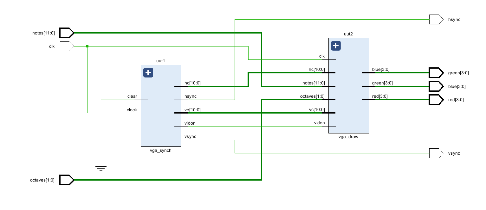

# FPGA Sound Synthesizer

**Digital Sound Generator System on FPGA with VGA and 7-Segment Display Integration**

---

### Description of the Project Idea
This project is a digital sound generator system implemented on an FPGA. It integrates sound synthesis, VGA output, and 7-segment display control for an interactive musical experience. The goal is to create a platform that produces various musical notes based on user input, offering visual feedback on a VGA monitor and a 7-segment display. Users can select notes, octaves, and modes, which are converted into sound signals using Pulse Width Modulation (PWM). This synthesis method generates different tones by adjusting the output signal's frequency and duty cycle, which plays through an external speaker. The project also includes a VGA controller for real-time graphics that represent selected notes and modes, alongside a 7-segment display showing the current note, octave, and mode clearly. The FPGA design ensures real-time operation and synchronization between sound and display outputs, providing a seamless user experience.

---

### Development Methodology, Tools Used, and Testing Strategy
- **Methodology:** Modular design approach with each functional block implemented and tested independently before system integration.
- **Tools Used:**
  - Xilinx Vivado for synthesis and implementation.
  - Basys3 FPGA development board for hardware implementation.
  - External VGA monitor and speakers for output verification.
- **Testing Strategy:**
  - Unit testing of individual modules such as Wave_summation_module & Wave_generator_module.
  - Functional testing with input vectors for all features.
  - Hardware testing to verify real-time functionality.

---

### Overall Design / Modular Architecture of the System

#### Input Interfaces

The input interfaces of the **Digital Sound Generator** allow users to define the musical characteristics, such as notes, octaves, and sound modes. These interfaces are essential for controlling the behavior of the system and enabling the generation of customized sound outputs. Below is an overview of the input interfaces and their functionalities

1. **Notes**  
   - **Type**: 12-bit vector  
   - **Description**: Each bit in the 12-bit vector corresponds to one of the 12 musical notes in an octave, ranging from **C** to **B**. When a specific bit is set to `1`, the system interprets it as the activation of the respective note.  
   - **Functionality**: Enables users to select the musical notes they want to play. Multiple notes can be activated simultaneously for chord synthesis.

2. **Octaves**  
   - **Type**: 3-bit vector  
   - **Description**: Represents the octave range, allowing users to specify which octave (0–7) the selected notes belong to.  
   - **Functionality**: Changes the pitch of the notes, shifting them higher or lower across octaves. This ensures versatility in creating sounds ranging from bass to treble.  

3. **Modes**  
   - **Type**: 5-bit vector  
   - **Description**: Each bit or combination of bits corresponds to a specific wave type or sound mode, such as **sine**, **square**, **triangle**, or custom waves.  
   - **Functionality**: Defines the waveform used for sound synthesis, allowing the user to change the tonal quality and texture of the generated sound.

These input interfaces work in unison to provide a rich and flexible platform for audio synthesis, enabling users to produce dynamic musical compositions through simple and intuitive control signals.

#### Output Interfaces

The **Digital Sound Generator** provides multiple output interfaces to deliver audio and visual feedback to users. These outputs are crucial for interpreting the system's functionality and engagingly presenting the results. Below are the details of each output interface:

1. **Audio Output**  
   - **Type**: Pulse Width Modulation (PWM) signal  
   - **Description**: The system generates sound by producing a PWM signal, which is then fed to a speaker. The frequency and waveform of the signal are determined by the selected notes, octaves, and modes.  
   - **Functionality**: Converts digital inputs into audible sound, enabling real-time audio synthesis.  

2. **7-Segment Display**  
   - **Type**: 4-digit display  
   - **Description**: Displays information such as the current note, octave, and mode selection. Each digit represents a specific parameter to provide an overview of the system's current state.  
   - **Functionality**: Offers a user-friendly way to monitor the system's operation and ensure accurate input selection.  

3. **VGA Output**  
   - **Components**:  
     - **clk**: Clock signal driving the VGA controller and synchronizing all operations.  
     - **notes**: A 12-bit input specifying the active musical notes for visual representation. 
     - **octaves**: A 3-bit input defining the octave range of the active notes.
     - **hsync & vsync**: Output synchronization signals for horizontal and vertical scanning.
     - **RGB Outputs (red, green, blue)**: 4-bit color signals used to generate the display colors on the VGA monitor.
   - **Description**:Integrates the VGA synchronization and drawing logic. It serves as the main interface for the VGA display system, connecting the clock and input signals (notes and octaves) to the submodules and outputting synchronization signals (hsync and vsync) along with RGB color values.  
   - **Functionality**: Ensures proper timing and alignment of the active display region, and creates a dynamic grid of colors that visualize the notes and octaves. Together, they produce a visually engaging and synchronized display for the sound synthesis process.

These output interfaces collectively enable users to interact with the system effectively, delivering both auditory and visual feedback for a comprehensive experience.

#### System Architecture

##### Components

1. **Wave Generator (`Wave_Generator.vhd`):**
   - Generates different waveforms
   - Supports 6 wave modes: Sine, Saw, Triangle, Violin, Saxophone, Flute
   - 64-point wave tables for each instrument
   - Configurable frequency and trigger

2. **Wave Summation (`Wave_Summation.vhd`):**
   - Combines multiple note waves
   - Supports 12 simultaneous notes
   - PWM audio output generation
   - Octave and mode selection

3. **VGA Controller (`vga_controller.vhd`, `vga_synch.vhd`, `vga_draw.vhd`):**
   - Generates VGA synchronization signals
   - Draws note visualization
   - Color-coded note representation
   - Supports different octaves and notes

4. **7-Segment Display (`Segment_Driver.vhd`, `Segment_Decoder.vhd`):**
   - Multiplexed 4-digit display
   - Shows current octave and note information
   - Dynamic display refresh

5. **Clock Divider (`Clock_Divider.vhd`):**
   - Generates slower clock signals
   - Enables display multiplexing

---

### Simulations and Results
- **Simulations Conducted:**
  - Functional simulation of wave generation in different modes (sine, sawtooth, triangle, etc.).
  - VGA controller simulation to verify synchronization and active area rendering.
- **Results:**
  - Verified timing and output correctness in simulation.
  - Observed accurate waveforms for audio signals.

    - Wave Generator
    
    - Wave Summation
    
   
---

### Hardware Implementation and Results
- **Input/Output Mapping:**
  - Inputs: Switches for selecting notes, octaves, and wave modes.
  - Outputs: Audio signal (via PWM), VGA display, and 7-segment display.
- **Results:**
  - Successful audio playback for selected notes.
  - Clear VGA visualization with red-highlighted active notes.
  - Correct real-time data display on 7-segment displays.

    [demo](Documents/demo.mp4)

---

### Hardware Description
- **GitHub Repository:** [Link to Repository](https://github.com/DushanStefan/FPGA_sounds_synthesizer)
- **Code Organization:**
  - `srcs/sources_1/new` - Contains all VHDL source files.
  - `srcs/sim_1/new` - Testbench files for simulation.
  - `srcs/constrs_1/new` - XDC files for pin mapping.

---

### Module-Wise RTL Schematics
- Vga Controller module
  
- Segment Divider Module
  
- Wave Summation Module
  
- Vga Sync Module
  
- Clock Divider Module
  
- Wave Generator Module
  
- Segment Decoder Module
  

---

### Constraints and Timing Analysis
- **Setup**
  - **Worst Negative Slack (WNS):** 2.876 ns  
  - **Total Negative Slack (TNS):** 0.000 ns  
  - **Number of Failing Endpoints:** 0  
  - **Total Number of Endpoints:** 791  
- **Hold**
  - **Worst Hold Slack (WHS):** 0.212 ns  
  - **Total Hold Slack (THS):** 0.000 ns  
  - **Number of Failing Endpoints:** 0  
  - **Total Number of Endpoints:** 791 
- **Pulse Width**
  - **Worst Pulse Width Slack (WPWS):** 3.000 ns  
  - **Total Pulse Width Negative Slack (TPWS):** 0.000 ns  
  - **Number of Failing Endpoints:** 0  
  - **Total Number of Endpoints:** 427
 
  The timing analysis report shows that all timing constraints for the FPGA design are successfully met. The setup timing has a worst negative slack (WNS) of 2.876 ns, indicating that the setup timing requirements are satisfied with sufficient margin. Similarly, the hold timing is also met with a worst hold slack (WHS) of 0.212 ns, meaning there are no hold violations. In terms of pulse width, the worst pulse width slack (WPWS) is 3.000 ns, ensuring the pulse widths are within the required range. Overall, there are no failing endpoints in any of the timing checks, and all user-specified timing constraints are met, indicating that the design is functioning as expected without any timing issues.
---

### Discussion
The primary objective of this project was to create a sound-generating system using a Basys3 FPGA board and VHDL programming. The system employs Pulse Width Modulation (PWM) to generate tones, and button inputs allow the user to control the sound frequencies. The implementation successfully generated variable-frequency PWM signals based on button inputs, enabling distinct tones to be produced. The key modules included a clock divider to reduce the 100 MHz system clock for tone generation, a PWM generator for square wave production, and button control logic to map user inputs to specific frequencies. Observations revealed the design’s ability to produce audible sounds, with accurate pin mapping and responsive user controls enhancing functionality.

Several challenges were encountered, notably the insufficient output voltage from the FPGA’s GPIO pins to directly drive a speaker, resulting in low sound volume. Issues with pin assignments required careful verification and debugging complexities such as the absence of a free-running clock added to the implementation difficulties. To address these, incorporating an external amplifier is recommended to boost the signal and drive the speaker effectively. Additionally, integrating a Digital-to-Analog Converter (DAC) for smoother sine waveforms and expanding the button logic to enable melody generation could significantly improve the system’s audio quality and functionality. Future developments could extend this work into educational tools, embedded audio systems, or signal processing applications, showcasing the versatility and potential of FPGA-based sound generation systems.

---

### Pending Unresolved Issues and Proposed Resolutions
- **Issues:**
  - Limited wave modes currently implemented.
  - Occasional flicker in VGA display at certain frequencies.
- **Proposed Resolutions:**
  - Extend wave mode library with additional complex timbres.
  - Optimize the VGA controller for stability.

---

### Future Prospects
- Integrate MIDI input for advanced sound control.
- Add more sophisticated audio synthesis algorithms.
- Enhance VGA visualization with dynamic animations.
- Implement a sophisticated DAC.

---

### References
- Element14 Community. (n.d.). *Building FPGA-based music instrument synthesis: A simple test bench solution*. Retrieved December 14, 2024, from [https://community.element14.com/challenges-projects/project14/musictime/b/blog/posts/building-fpga-based-music-instrument-synthesis-a-simple-test-bench-solution](https://community.element14.com/challenges-projects/project14/musictime/b/blog/posts/building-fpga-based-music-instrument-synthesis-a-simple-test-bench-solution)
- Digilent. (n.d.). *Basys 3 reference manual*. Retrieved December 14, 2024, from [https://digilent.com/reference/programmable-logic/basys-3/reference-manual?srsltid=AfmBOorIo4y9iTcDXtzfjdwfg7c7GRB07hIPlkTTn2yKmJZE8aBkN8qJ](https://digilent.com/reference/programmable-logic/basys-3/reference-manual?srsltid=AfmBOorIo4y9iTcDXtzfjdwfg7c7GRB07hIPlkTTn2yKmJZE8aBkN8qJ)
- GitHub. (n.d.). *FPGA-Synthesizer*. Retrieved December 14, 2024, from [https://github.com/kiran2s/FPGA-Synthesizer](https://github.com/kiran2s/FPGA-Synthesizer)

